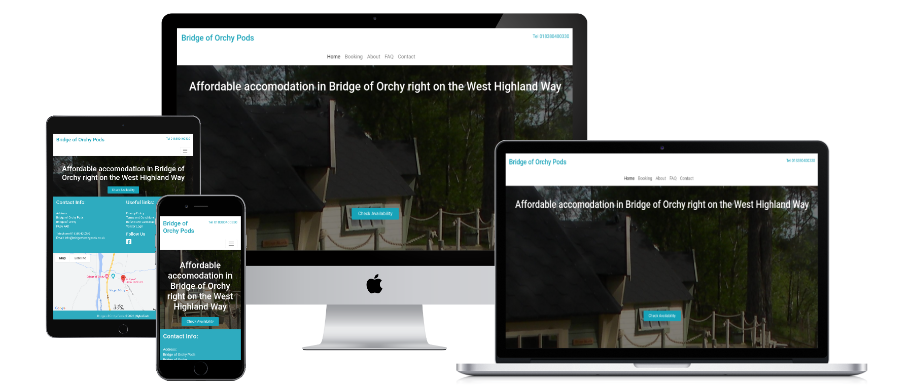

# Bridge of Orchy Outdoors is a two pod accomodation service located in Bridge of Orchy catering for WHW walkers.
BOO Outdoors offers an online booking sercvice to make reservation via the website.  
Visitors will be able to check availability and price.  
Visitors will be able to make reservation.  
Visitors will be able to get email confirmation.  
Visitors will be able to send messages.  
Visitors will be able to read FAQs.  
Visitors will be able to find the location of the accomodation via integrated Google maps.  

Owners will be able to add availability.  
Owners will be able to set prices.  
Owners will be able to add restrictions such day and/or pods level.  
Owners will be able to receive confirmation email.  
Owners will be able to receive messages from visitors.  
Owners will be able to track bookings all / current /cancelled.  
Owners will be able to make amendment to existing bookings.
Owners will be able to cancel bookings.  
Owners will be able to add FAQ questions / answers.  
Owners will be able to update FAQ questions / answers.  
Owners will be able to delete FAQ questions / answers.  
Owners will be able to change basic setting information such name of website, email address, telephone number and annual rate.   

Login for superuser: username: outdoors password: code2545

 

**View the live site [here](http://bridgeoforchypods.co.uk/)**

## GITHUB
This where the source code is stored.   
**Sign up [here](https://github.com/)**  
Create a new repository (something similar of the website name), keep it private so people cannot access your source code.
Clone repo from the original source.
Launch code with GITPOD (GITPOD extension is needed from Google store)
## VS CODE
This is an online version of VS CODE which can be accesses from anywhere. 
Additional extensions might be needed to run at the first time. 
## HEROKU
**Sign up [here](https://heroku.com/)**  
Create a new app (something similar of the website name), keep it private so people cannot access your source code.
Clone repo from the original source.
Launch code with GITPOD (GITPOD extension is needed from Google store)